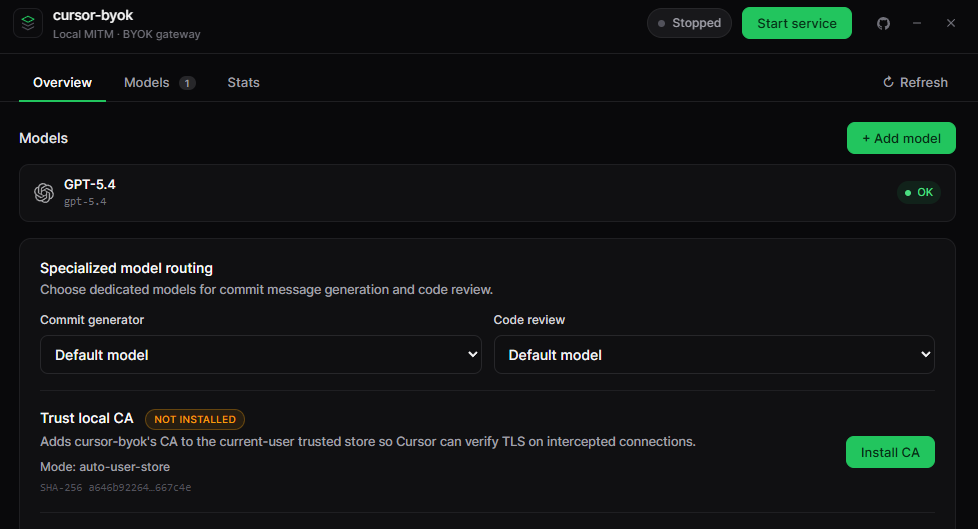
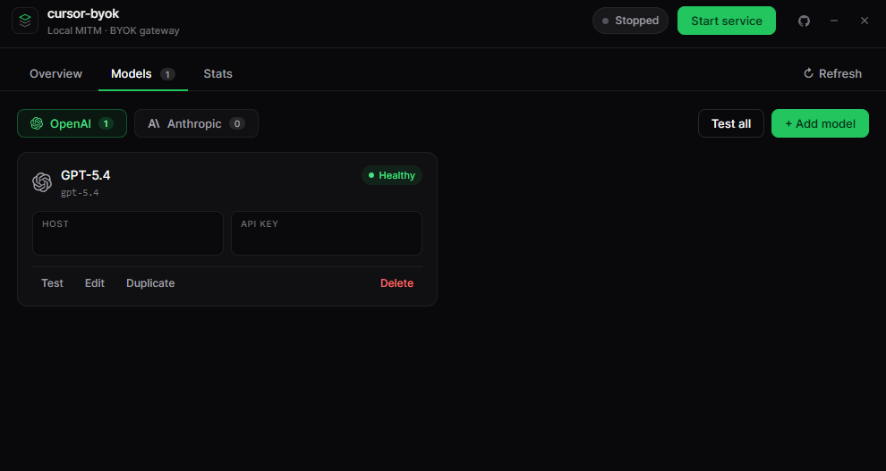
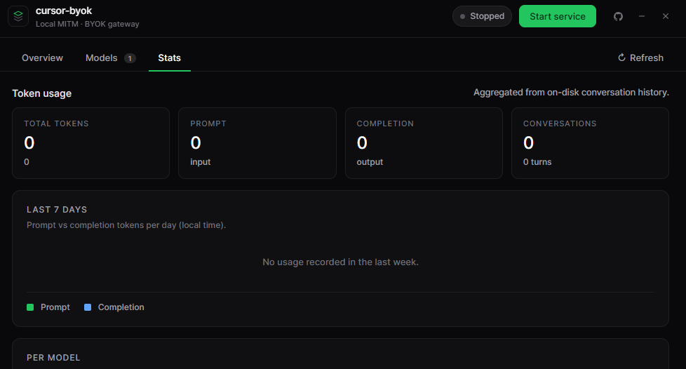

# cursor-byok

[](https://github.com/Yimikami/cursor-byok/actions/workflows/ci.yml)
[](https://github.com/Yimikami/cursor-byok/actions/workflows/release.yml)
[](https://github.com/Yimikami/cursor-byok/releases/latest)

A local desktop app that turns the Cursor IDE into a **Bring-Your-Own-Key** client.
cursor-byok runs an on-device HTTPS MITM proxy, intercepts Cursor's traffic to
`api2.cursor.sh`, forges a logged-in "Pro" session, and translates Cursor's
proprietary Connect-RPC agent protocol into **OpenAI Chat Completions** against
any OpenAI-compatible or Anthropic provider you configure.

> **Status:** research / personal-use project. Expect rough edges. Running it
> mutates Cursor's local settings and SQLite store — see
> [Safety & caveats](#safety--caveats) before you start it.

---

## Features

- **BYOK gateway** — use OpenAI, Anthropic, or any OpenAI-compatible endpoint
  (Groq, OpenRouter, local vLLM/llama.cpp, etc.) as the backing model.
- **Full agent loop** — tool calls, file reads/writes, shell exec, MCP tools,
  Plan mode with live `.plan.md` panel updates, mode switching (Agent / Ask /
  Plan / Debug) — all routed through your own model.
- **Drop-in for Cursor** — no Cursor account needed. A synthetic Pro session is
  injected into Cursor's local SQLite so the chat picker and agent UI behave as
  if you were signed in.
- **System tray app** — built with Wails 3 (Go backend + Vue 3 frontend), start
  / stop the service from the tray, edit adapters from the dashboard.
- **Usage stats** — per-model token totals and a 7-day prompt/completion chart
  aggregated from persisted per-turn artifacts. No pricing estimates — BYOK
  providers bill wildly differently.
- **Conversation persistence** — every turn is written to
  `%APPDATA%/cursor-byok/history/<conversation-id>/` so chats survive restarts.

---

## How it works (high level)

```
Cursor IDE
    │  (system proxy → 127.0.0.1:18080)
    ▼
cursor-byok MITM
    │  intercepts only the four Cursor RPC paths the agent needs,
    │  404s everything else so Cursor's BYOK picker stays happy
    ▼
Agent loop  ─────►  OpenAI Chat Completions / Anthropic Messages
    │              (your provider, your API key)
    ▼
Cursor receives Connect-SSE frames translated back into its native
AgentService / BidiService protocol.
```

Only these four Cursor paths are handled:

| Path                                              | Purpose                                 |
| ------------------------------------------------- | --------------------------------------- |
| `/aiserver.v1.BidiService/BidiAppend`             | user input / tool results / UI verdicts |
| `/agent.v1.AgentService/RunSSE`                   | streamed agent output                   |
| `/aiserver.v1.AiService/AvailableModels`          | synthetic (your BYOK adapters)          |
| `/aiserver.v1.AiService/GetDefaultModelNudgeData` | synthetic default-model hint            |

Everything else on `api2.cursor.sh` and Cursor's auth hosts is 404'd on
purpose — any auxiliary RPC returning real upstream data can flip Cursor's chat
picker into "BYOK not allowed" and hide the injected models.

---

## Requirements

- **OS:**
  - **Windows 10/11 (64-bit):** full supported path
  - **macOS:** supported with automatic CA install into the current user's login keychain
  - **Linux:** supported with Cursor settings tweaks plus CA trust via the user's NSS DB when `certutil` is installed; otherwise manual CA import is required for full HTTPS MITM trust
- **Cursor IDE** installed and closed the first time you enable the service.
- **Go** ≥ 1.25
- **Node.js** ≥ 18 and **npm**
- **Wails 3 CLI** (`go-task`-backed):
  ```powershell
  go install github.com/wailsapp/wails/v3/cmd/wails3@latest
  ```
- **Linux only (recommended for automatic CA trust):** `certutil` from `libnss3-tools` / `nss-tools`
- An API key for an OpenAI-compatible or Anthropic-compatible provider.

---

## Build from source

```powershell
# 1. Clone
git clone https://github.com/Yimikami/cursor-byok.git
cd cursor-byok

# 2. Frontend deps
cd frontend
npm install
cd ..

# 3. Dev run (hot reload)
wails3 dev -config ./build/config.yml -port 9245

# 4. Production build → bin/cursor-byok.exe
wails3 build

# 5. Installer (NSIS default, or MSIX)
wails3 package
$env:FORMAT="msix"; wails3 package
```

---

## UI Preview

### Overview

Shows proxy state, CA install status, Cursor tweak status, and start/stop
controls in one place.



### Models

Manage OpenAI-compatible and Anthropic adapters, test them against the upstream
provider, and choose what Cursor sees in its model picker.



### Stats

Local token accounting is aggregated from persisted turn summaries so you can
see per-model usage and recent activity without depending on provider billing
dashboards.



---

## First-time setup

1. Launch cursor-byok. It minimizes to the tray.
2. Open the dashboard (tray → "Show cursor-byok") and go to the **Overview** tab.
3. Click **Install CA**.
   - **Windows:** installs into the current-user Trusted Root store.
   - **macOS:** installs into the current-user login keychain.
   - **Linux:** imports into the user's NSS DB (`~/.pki/nssdb`) when `certutil` is available.
4. If you are on Linux and the dashboard still shows a CA warning, export the PEM from the settings folder and import it manually into the system/browser trust store used by the apps you care about.
5. Go to the **Models** tab and add at least one adapter:
   - **Type:** `openai` or `anthropic`
   - **Base URL:** e.g. `https://api.openai.com/v1`, `https://api.anthropic.com`,
     `https://openrouter.ai/api/v1`, `http://127.0.0.1:8080/v1`
   - **API key**, **Model ID** (e.g. `gpt-4o`, `claude-3-5-sonnet-latest`,
     `openai/gpt-oss-20b`)
   - Optional: reasoning effort, service tier, max output tokens, thinking budget.
6. Back on **Overview**, click **Start service**. This:
   - Enables the system proxy on Windows and macOS
   - Leaves Linux system proxy untouched, but writes Cursor's own proxy settings so Cursor itself routes through `127.0.0.1:18080`
   - Writes `http.proxy` / `http.proxyStrictSSL: false` and related Cursor settings (originals backed up)
   - Injects the synthetic Pro session into Cursor's `state.vscdb` (originals backed up to `cursor-auth-backup.json`)
7. Open Cursor. Your adapter appears in the model picker. Chat away.
8. Click **Stop service** when done — proxy state, Cursor settings, and auth are restored to what they were before.

---

## Where your data lives

Under the user config root for your platform:

- **Windows:** `%APPDATA%/cursor-byok/`
- **macOS:** `~/Library/Application Support/cursor-byok/`
- **Linux:** `${XDG_CONFIG_HOME:-~/.config}/cursor-byok/`

| Path                                  | What                                              |
| ------------------------------------- | ------------------------------------------------- |
| `config.json`                         | adapters + user settings (contains your API keys) |
| `ca/`                                 | self-signed root CA used for MITM                 |
| `cursor-auth-backup.json`             | your original Cursor auth, restored on Stop       |
| `history/<conv-id>/conversation.json` | ordered turn log                                  |
| `history/<conv-id>/turns/NNNNNN/`     | per-turn request / SSE / summary artifacts        |

The Stats tab aggregates every `turns/*/summary.json` on disk.

---

## Configuration reference

`config.json` schema (`ModelAdapterConfig`):

```jsonc
{
  "modelAdapters": [
    {
      "displayName": "GPT-4o",
      "type": "openai", // "openai" | "anthropic"
      "baseURL": "https://api.openai.com/v1",
      "apiKey": "sk-...",
      "modelID": "gpt-4o",
      "reasoningEffort": "", // openai reasoning models: low|medium|high|xhigh
      "serviceTier": "", // openai: auto|default|flex|priority
      "maxOutputTokens": "",
      "thinkingBudget": "", // anthropic extended-thinking
    },
  ],
}
```

The first adapter in the list is used as the active model and is pinned into
every Cursor feature slot (composer / cmd-K / agent / etc.).

---

## Project structure

```
.
├── main.go                      # Wails entry + system tray
├── internal/
│   ├── agent/                   # core agent loop (bidi, RunSSE, tools, history)
│   ├── bridge/                  # ProxyService exposed to the Vue frontend
│   ├── certs/                   # self-signed CA + Windows root-store install
│   ├── cursor/                  # system proxy, settings.json, SQLite injections
│   ├── mitm/                    # goproxy-based HTTPS MITM server
│   ├── protocodec/gen/          # generated protobuf types for Cursor RPCs
│   └── relay/                   # synthetic AvailableModels / DefaultModel responses
├── frontend/                    # Vue 3 + Vite dashboard
│   └── src/components/ProxyDashboard.vue
├── build/                       # Wails build config + icons + installer templates
├── proto/                       # .proto sources for the generated types
└── Taskfile.yml                 # go-task targets the Wails3 CLI dispatches into
```

---

## Safety & caveats

- **This is MITM software.** It installs a local root CA and routes Cursor HTTPS traffic through localhost while the service is running. Only run it on a machine you control.
- **Platform trust differs:**
  - **Windows:** current-user Trusted Root store
  - **macOS:** current-user login keychain
  - **Linux:** user NSS DB (`~/.pki/nssdb`) when `certutil` is available; otherwise you must import the CA manually into the trust stores you use
- **Linux has no single vendor-neutral trust store.** Automatic NSS import covers Chromium/Electron-style consumers that use NSS, but not every distro, browser, or CLI stack. Manual trust may still be required.
- **Cursor's settings.json and SQLite store are modified.** Originals are backed up and restored on Stop, but if the app is killed mid-run you may need to revert manually.
- **API keys are stored in plain text** in cursor-byok's `config.json` with user-only permissions where supported. If that's not acceptable for your threat model, don't use this.
- **Cursor's protocol is proprietary.** cursor-byok tracks behavioural fidelity with specific Cursor versions; a Cursor update can break it at any time.
- **This project is not affiliated with or endorsed by Anysphere / Cursor.** All trademarks belong to their respective owners.

---

## Downloads

Pre-built binaries for every tagged release are attached to the corresponding
[GitHub Release](https://github.com/Yimikami/cursor-byok/releases):

| Platform                                 | File                                                    |
| ---------------------------------------- | ------------------------------------------------------- |
| Windows (x64)                            | `cursor-byok-<version>-windows-amd64.zip`               |
| macOS (Apple Silicon + Intel, universal) | `cursor-byok-<version>-macos-universal.zip` / `.tar.gz` |
| Linux (x64)                              | `cursor-byok-<version>-linux-amd64.tar.gz`              |

Each asset ships with a matching `.sha256` sidecar for integrity checking.

---

## Releasing

Releases are cut entirely by the `.github/workflows/release.yml` workflow. To
publish a new version:

1. Fill in the matching section in [`CHANGELOG.md`](CHANGELOG.md) (optional but
   recommended — the content is prepended to the auto-generated release body).
2. Commit and push to `main`.
3. Tag and push:
   ```bash
   git tag -a v0.1.0 -m "v0.1.0"
   git push origin v0.1.0
   ```
4. The workflow will:
   - Build Windows `amd64`, Linux `amd64`, and a macOS **universal** binary in
     parallel on GitHub-hosted runners.
   - Package each into a `.zip` / `.tar.gz` with a `.sha256` sidecar.
   - Create a GitHub Release at that tag, combining (a) your `CHANGELOG.md`
     entry with (b) auto-generated notes (PRs since the previous tag,
     categorised by label via [`.github/release.yml`](.github/release.yml)).
   - Upload every artifact to the release.

Pre-release tags (`v0.1.0-rc.1`, `v0.1.0-beta.2`, …) are automatically marked
as **Pre-release** on GitHub.

You can also trigger the workflow manually from the Actions tab
("Run workflow" → enter an existing tag) if a run needs to be re-done.

---

## Credits

cursor-byok stands on the shoulders of two open-source Cursor-BYOK efforts
that documented the on-the-wire behaviour of Cursor IDE long before this
project existed. Huge thanks to:

- [**burpheart/cursor-tap**](https://github.com/burpheart/cursor-tap) —
  reference implementation of the Cursor MITM + Connect-RPC translation
  layer. The four RPC paths this project intercepts (`BidiAppend`,
  `RunSSE`, `AvailableModels`, `GetDefaultModelNudgeData`) and the
  synthetic-Pro auth trick were pioneered there.
- [**leookun/cursor-byok-server**](https://github.com/leookun/cursor-byok-server) —
  BYOK gateway approach, tool-call frame layout, and several behavioural
  details around Cursor's agent loop the reverse-engineering of which
  saved weeks of packet capture here.

If you're shipping something in this space, read both repos first — they
each solve the problem with different tradeoffs, and some users will be
better served by those projects than by this one.

---

## License

cursor-byok is licensed under the **GNU Affero General Public License v3.0
or later** (AGPL-3.0-or-later). See [`LICENSE`](LICENSE) for the full text.

The short version:

- You may use, modify, and redistribute this software freely.
- If you distribute a modified version — **including running it as a
  network service others interact with** — you must make the complete
  source code of your modifications available under the same AGPL-3.0
  licence.
- No warranty. Use at your own risk.

The AGPL's network clause is deliberate: this is a MITM proxy that ships
with a technique for bypassing Cursor's auth. If someone turns that into
a closed-source SaaS, downstream users deserve the source back.
